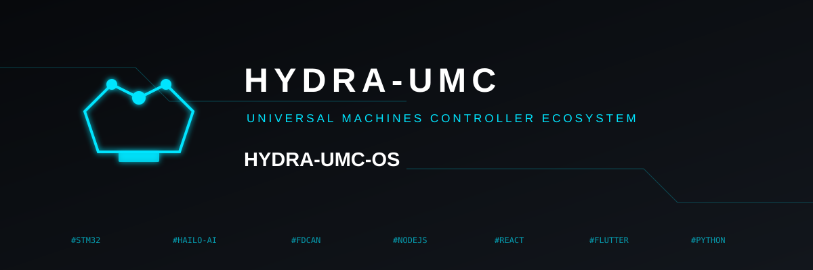
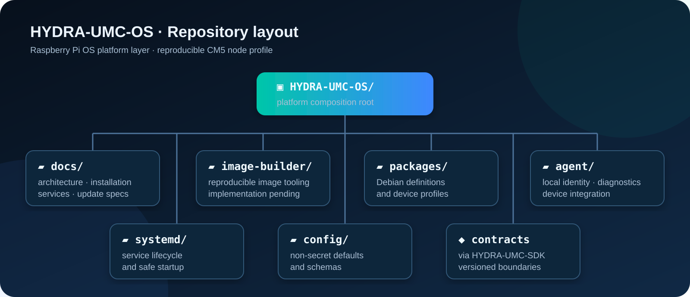

<!--
=====================================================================
HYDRA-UMC-OS - 公開プロジェクトの概要と実装ガイド
Copyright (C) 2026 JuanenRac (エレクトロホビー 3D) <electrohobby3d@gmail.com>
CC BY-SA 4.0 - LICENSE.md を参照
=====================================================================
-->

  

  <a href="README.md">???? English</a> |
  <a href="README_spa.md">🇪🇸スペイン語</a> |
  <a href="README_fra.md">🇫🇷 フランス語</a> |
  <a href="README_ita.md">🇮🇹 イタリアーノ</a> |
  <a href="README_deu.md">🇩🇪 ドイツ語</a> |
  <a href="README_zho.md">🇨🇳 简体中文</a> |
  <a href="README_jpn.md">🇯🇵 日本語</a>

  
  
  
  

# ヒドラ-UMC-OS

## 🖥️ Raspberry Pi OS 用の HYDRA-UMC プラットフォーム レイヤー

HYDRA-UMC-OS は、HYDRA-UMC CM5 ノードにインストール可能なプラットフォーム層です。
Raspberry Pi OS ARM64 上に構築されています。 Linux に代わるものではありません。
Raspberry Pi カーネル、systemd、NetworkManager、libcamera、またはベンダー SDK。

その責任は、再現可能な HYDRA-UMC デバイス プロファイルを提供することです。
構成、サービス ライフサイクル、ローカル ID、診断、ビジュアル
ブランド化、および HYDRA-UMC コンポーネントの更新の調整。

## 🚧 ステータス

基本エージェント、検証済みの非機密構成、強化された systemd
ユニットとホスト側のテストが実装されます。エージェントは意図的に
読み取り専用: 製品イメージ アセンブリと CM5 ハードウェア検証は残ります
個別のリリースゲート。

インストールのプリフライト（`provisioning/preflight_cm5.py`）は、実際のテストによって冪等性があり副作用がないことが証明されている——2回連続で実行してもバイト単位で同一の出力が得られ、このリポジトリ内のファイルには一切触れない——そして、実際のホスト非依存なバックアップ/ロールバック機構（`provisioning/rollback.py`）が、`install_local_agent.sh` が実行のたびに無条件で上書きする唯一のシステムファイルを保護する。どちらも root 権限や CM5 なしで検証されている——`tools/verify_preflight_idempotent.py` と `tools/verify_rollback.py` を参照。

## 🎯 計画された最初のマイルストーン

1. CM5 用の Raspberry Pi OS ARM64 プロファイルを構築します。
2. `hydra-umc-platform-b​​ase` と `hydra-umc-agent` をインストールします。
3. CM5 インターフェイスを検出し、「DeviceDescriptor」と「HealthReport」を報告します。
4. systemd を介して有効なサービスのみを開始します。
5. ローカルで READY、DEGRADED、INHIBITED、または FAULT を表示します。

## 📂 リポジトリのレイアウト

  

|パス |目的 |
| --- | --- |
| `docs/` |アーキテクチャ、インストール、サービス、およびアップデートの仕様。 |
| `イメージビルダー/` |公式の Raspberry Pi OS イメージ アセンブリの境界と再現性に関するメモ。 |
| `パッケージ/` | 「hydra-umc-platform-b​​ase」の Debian パッケージのメタデータ。 |
| `エージェント/` |単体テストを備えた読み取り専用の Python デバイス記述子とヘルス エージェント。 |
| `systemd/` |強化された「hydra-umc-agent.service」ライフサイクル ユニット。 |
| `config/` |デフォルトのスキーマと非シークレット構成。 |

コードを実装する前に、[アーキテクチャ](docs/ARCHITECTURE.md) をお読みください。

## 🔗 関連プロジェクト

> 正規の公開エコシステム関係マップ。

|プロジェクト | HYDRA-UMC-OSとの関係 |
| --- | --- |
| [HYDRA-UMC-SDK](https://github.com/JuanenRac/HYDRA-UMC-SDK) |デバイス エージェントによって使用される、バージョン管理されたコントラクト、シン クライアント、および適合フィクスチャ。 |
| [HYDRA-UMC-SERVER](https://github.com/JuanenRac/HYDRA-UMC-SERVER) |ノードのマネージド統合の認証されたサービス境界。 |
| [HYDRA-UMC-UPDATER](https://github.com/JuanenRac/HYDRA-UMC-UPDATER) |アーティファクト レジストリ、互換性メタデータ、および調整された更新ワークフロー。 |
| [HYDRA-UMC](https://github.com/JuanenRac/HYDRA-UMC) | OS 層が構成および監視する CM5/MCU ハードウェアおよびファームウェア プラットフォーム。 |
| [URTC](https://github.com/JuanenRac/URTC) |明示的なバージョン管理されたアダプターを通じて統合された、独立したツールとコントローラーのプラットフォーム。 |

**残りのエコシステム:** [JuanenRac エコシステム ダッシュボード](https://juanenrac.github.io/JuanenRac/) で 7 つのパブリック レイヤーを調べてください。

## 📜ライセンス

コードは GPL-3.0 以降、ドキュメントは CC BY-SA 4.0 です。 [ライセンス](LICENSE)を参照してください。

## 🛠️ BUILD & RUN

リリースビルドの前に、バージョンを変更しないビルドチェックを使用してください。

| 操作 | Windows | Linux / macOS |
|---|---|---|
| ビルドチェック（バージョンと CHANGELOG を変更しない） | `build-test.bat` | `./build-test.sh` |
| 実行 / 開発（提供されている場合） | `run*.bat` または `dev*.bat` | `./run*.sh` または `./dev*.sh` |

`build-test.bat` と `build-test.sh` は、`hydra-umc.project.json` をインクリメントせず、`CHANGELOG.md` も変更せずにプロジェクトのスタックをコンパイルまたは検証します。通常のコンパイラ出力だけが作成される場合があります。既存の `build*.bat`、`build*.sh`、`run*`、`dev*` は、各プロジェクト固有のバージョン化または実行時の動作を維持します。その動作が必要な場合はそれらを使用してください。